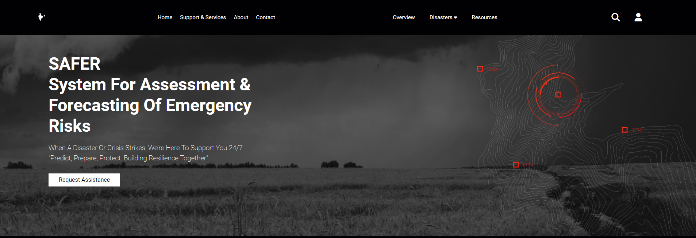
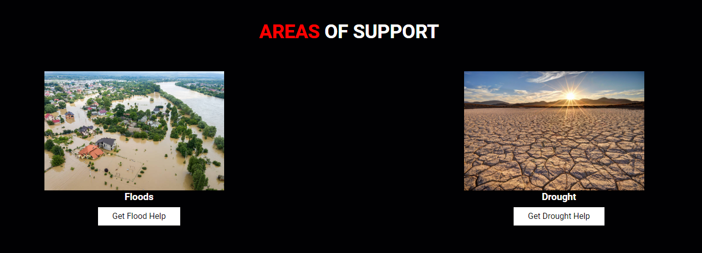
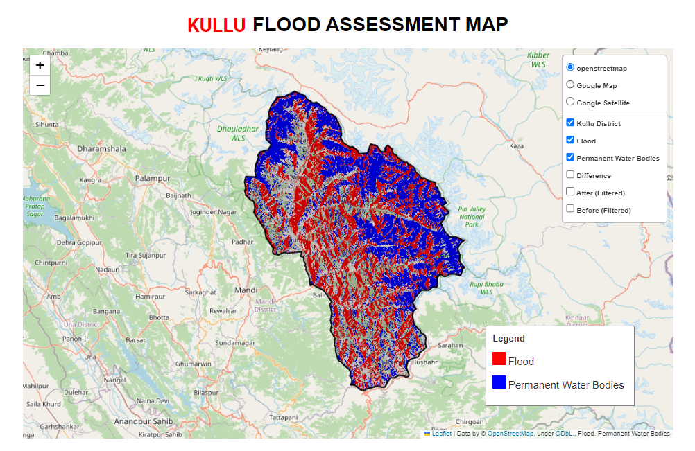
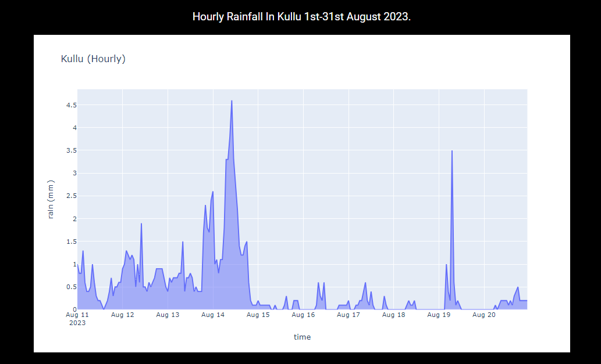
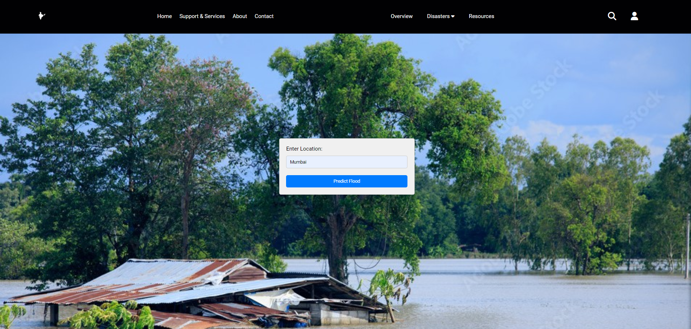
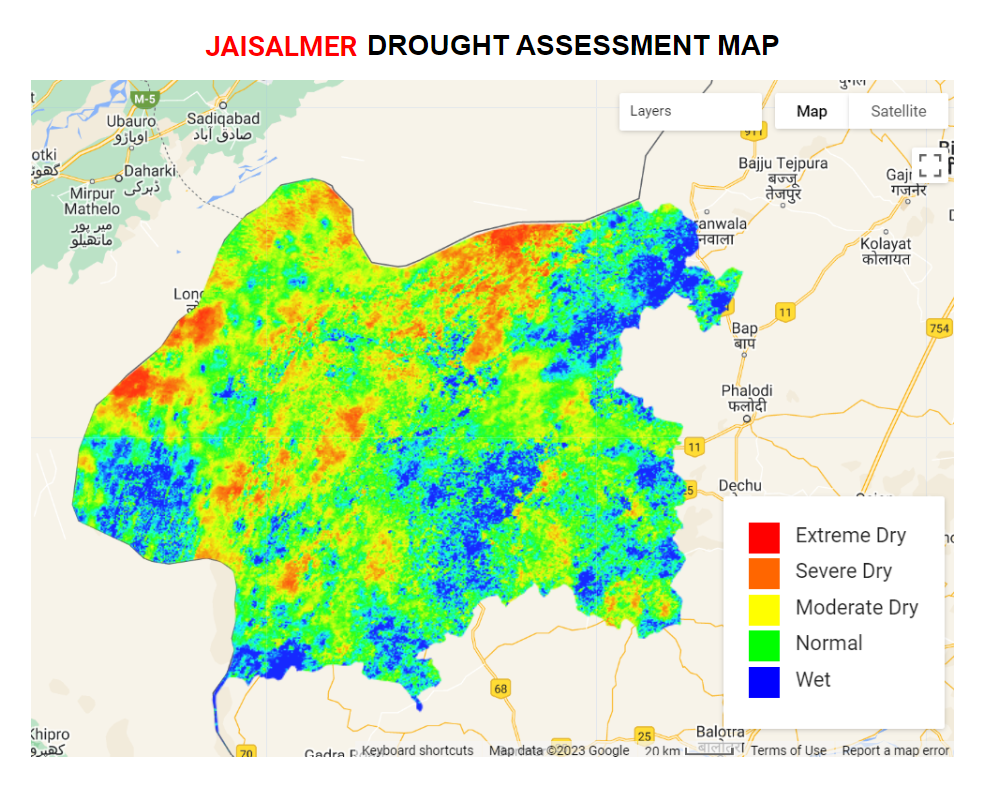
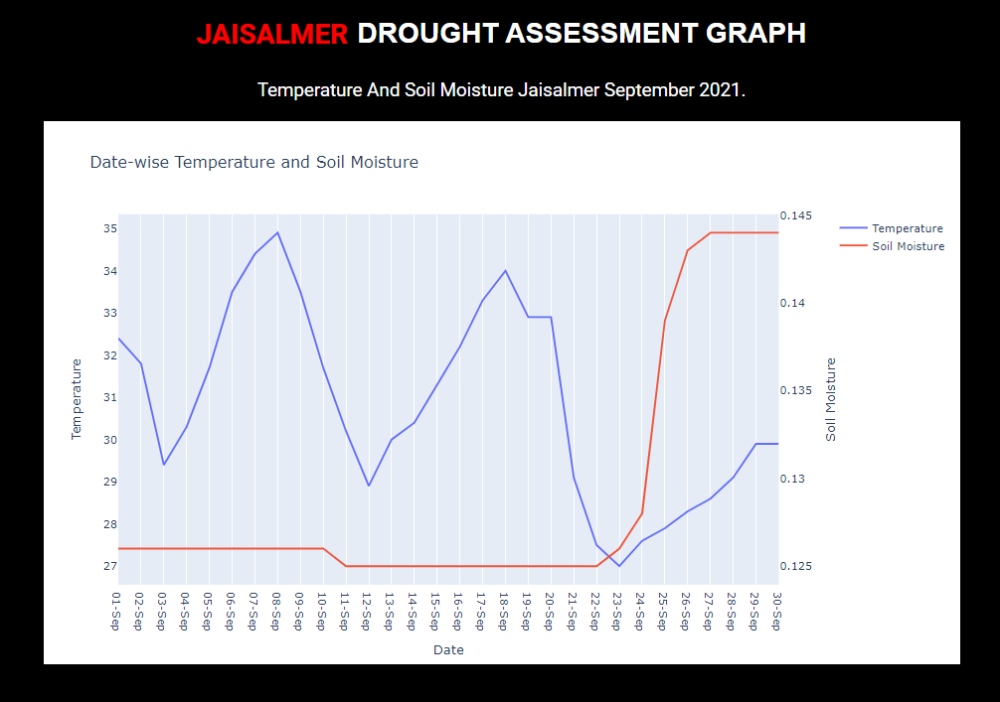
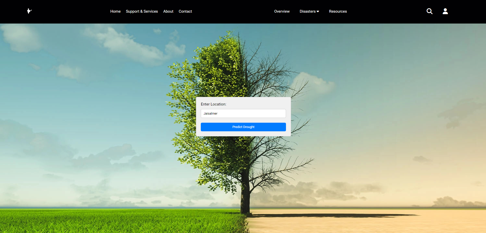

# SAFER: System for Disaster Assessment and Forecasting of Emergency Risks

Floods and droughts are highly destructive natural disasters posing threats to life and property. Timely and accurate prediction is crucial for effective disaster management. SAFER (System for Disaster Assessment and Forecasting of Emergency Risks) serves as a beacon of hope, offering advanced analysis and forecasting to protect lives and property during recovery. 🌊🏜️

## Overview

SAFER employs advanced technologies in its assessment phase, utilizing **Google Earth Engine** to create detailed Assessment Maps. These maps integrate satellite data from **Sentinel 1A** for flood assessments and **MODIS** for drought evaluations, offering a visual depiction of affected areas and insights into the extent of damage caused. 🌍📡

Accompanying graphs, drawing data from the **Open Meteo API**, contribute to the assessment process by illustrating the correlation between affected regions and key meteorological factors such as rainfall for floods and temperature and soil moisture for droughts. 📊🌧️🌡️

Moving beyond assessment, SAFER leverages real-time data from the Open Meteo API to predict future emergency risks. The forecasting model anticipates future emergency risks, enabling proactive measures and timely responses. ⏰🔮

## Key Features

- **Advanced Assessment Maps:** Utilizes Google Earth Engine to create detailed maps integrating satellite data for flood and drought assessments.🛰️
- **Real-time Data Integration:** Integrates real-time data from the Open Meteo API for accurate assessment and forecasting.📊
- **Predictive Analytics:** Forecasts future emergency risks based on current and historical data, enabling proactive measures.🔮
- **Holistic Approach:** Provides a comprehensive solution to assess, visualize, and forecast floods and droughts.🔄

## Usage

1. Run the assessment module to generate detailed Assessment Maps.
2. Utilize the forecasting module to predict future emergency risks based on real-time data.
3. Explore accompanying graphs and visualizations for insights into meteorological factors.

## Social Benefits

### 1. Disaster Preparedness and Response

- **Recovery Assistance**: Governments and NGOs can provide recovery assistance based on assessments of affected areas.🤝🏢
- **Risk Prediction**: People can predict floods and droughts, anticipating future emergency risks.🌊🔥

### 2. Reduced Economic Losses

- **Effective Disaster Management**: Through effective disaster management and preparedness, economic losses can be minimized.💰

### 3. Environmental Conservation

- **Informed Land-Use Planning**: Facilitating more informed land-use planning and disaster response indirectly contributes to environmental conservation.🌳

### 4. Empowerment Through Information

- **Access to Information**: Access to accurate and timely information empowers individuals to make informed decisions during emergencies. 📈

## Future Work Proposal

### 1. Real-time Alert System
Implement a real-time alert system that notifies relevant government agencies and the public immediately after a potential disaster is predicted. ⚠️

### 2. Disaster Expansion
Include additional disasters such as Cyclones, earthquakes, tsunamis, and landslides to enhance the coverage and effectiveness of the alert system.🌀🌍🌊🏔️

### 3. Predictive Analytics for Evacuation Planning
Utilize predictive analytics to forecast when and where evacuations might be necessary during emergencies. This includes the deployment of resources for evacuation efforts, ensuring a more efficient and timely response to disaster situations.

## Awards and Achievements

- **Aavishkar Inter-Collegiate / Institute / Department
Research Convention 2023-24**🤩
  - University of Mumbai
  - Placement: Second round of the zonal poster presentation
  - Advanced to the second round of the zonal poster presentation at the Aavishkar event organized by the University of Mumbai. This achievement highlights dedication to interdisciplinary research and innovative solutions.

- **Exalt Techfest Mini-Project Competition 2024**🥳
  - A. P. Shah Institute of Technology, Thane
  - Placement: 4th Place
  - Secured an impressive 4th place in the Exalt Techfest Mini-Project Competition held at A. P. Shah Institute of Technology, Thane. This recognition reflects ability to deliver impactful solutions and showcases commitment to excellence in project development.

## Acknowledgements

- [Google Earth Engine](https://earthengine.google.com/) for satellite data integration.🛰️
- [Open Meteo API](https://open-meteo.com/) for real-time meteorological data.🌦️
- [Sentinel-1A](https://sentinel.esa.int/web/sentinel/missions/sentinel-1) for satellite data used in flood assessments.🌊
- [MODIS](https://modis.gsfc.nasa.gov/) for drought data used in drought assessments.🏜️

## License

This project is licensed under the GNU GENERAL PUBLIC LICENSE Version 3.

## Contact

For questions or support, please contact sonalsonarghare30@email.com.

  

  

  <h2>FLOOD</h2>
  
  
  

  <h2>DROUGHT</h2>
  
  
  

https://github.com/SonalSonarghare/SAFER-System-for-Disaster-Assessment-and-Forecasting-of-Emergency-Risks/assets/116957485/d1c57273-f06a-4a58-953a-98662f421b70

